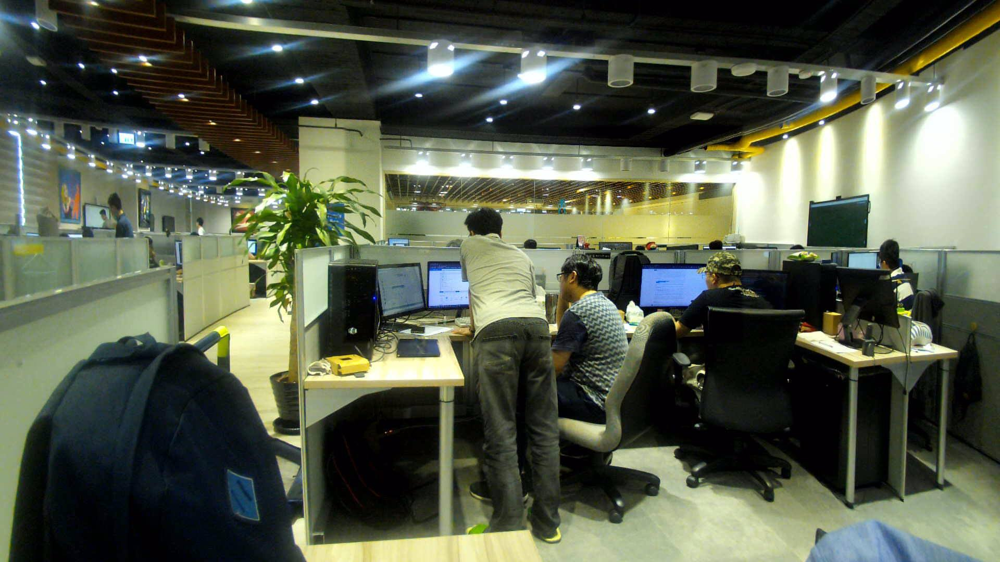
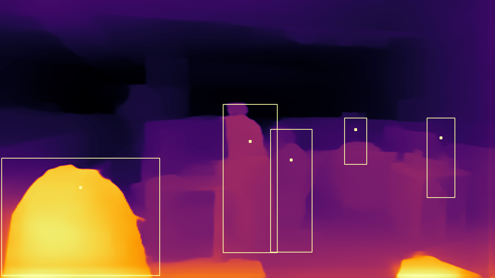

# openvino_pretrained_person_depth

RGB IMAGE            |  Depth Map wit Person Objects
:-------------------------:|:-------------------------:
     |  


## Quickly Start
At first, download OpenVINO pretained models from [GoogleDrive](https://drive.google.com/file/d/1Jf7qRG9N8IW8CaZ7gPisO5RtlLl63mNA) and [OpenVINO Model Zoo](https://download.01.org/opencv/2021/openvinotoolkit/2021.1/open_model_zoo/models_bin/2/person-detection-retail-0013/FP32/).
Then putting them under folder "models".

>**!!Note!!**
>
> _The depth output in the app is inverted and provided up to unknown scale and shift, i.e. only inversely relative depth is available._  
> _In each frame, existing a linear equation like "P = D * scale + shift" to project the values of depth maps "D" to the inverse physical absolute measurements "P" according to putting a known scale ruler in the view._
>

 ```Shell
|__ openvino_pretrained_person_depth
    |__ img
    |__ models
        |__ midasnet
        |__ person-detection-retail-0013
    |__ main.py
    |__ Readme.md
    |__ install_requirements.bat
```
Build docker image with `docker build -t openvino_depth:latest .` in project root directory.
Run below command to start app

`docker run --isolation=process --device="class/{interface class GUID of camera}" openvino_depth:latest`

## Ref
* Dockerfile for OpenVINO on Windows Container 
https://docs.openvinotoolkit.org/latest/_docs_install_guides_installing_openvino_docker_windows.html

* Run a Windows Container with a Device
https://docs.microsoft.com/en-us/virtualization/windowscontainers/deploy-containers/hardware-devices-in-containers

* Depth Model - MiDaS
https://github.com/intel-isl/MiDaS